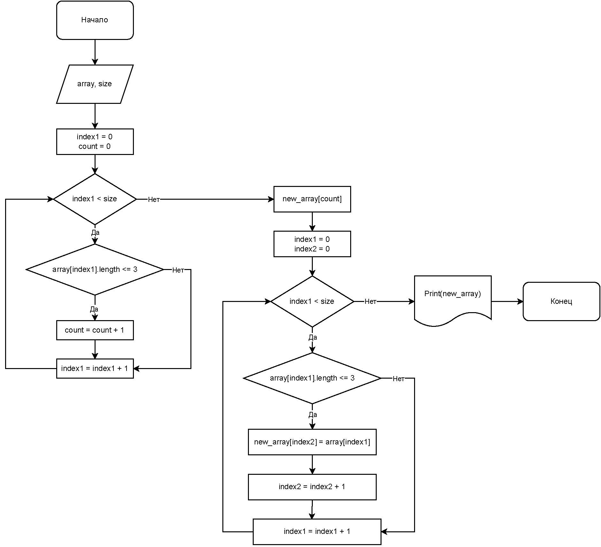

# Контрольная работа по итогам курса "Разработчик. Основной блок"

## Описание

Данная программа является учебной. Она разработана в рамках контрольной работы по итогам курса "Разработчик. Основной блок" от GeekBrains.  
Программа позволяет сформировать одномерный массив строк размерности n. Значения строк и размерность массива задаются пользователем. Далее программа из имеющегося массива строк формирует новый одномерный массив из строк, длина которых меньше или равна 3 символам. 

## Использование

Для использования программы необходимо открыть файл Program.cs в интегрированном терминале Visual Studio Code. Запуск программы осуществляется командой dotnet run. 

## Алгоритм работы программы

Представленный ниже алгоритм описывает логику работы основного функционала программы. Создание исходного одномерного массива строк размерности n и его заполнение данными алгоритмом не учитываются. 

## Разработчик

Зацепин Дмитрий

zatsepindm@gmail.com

